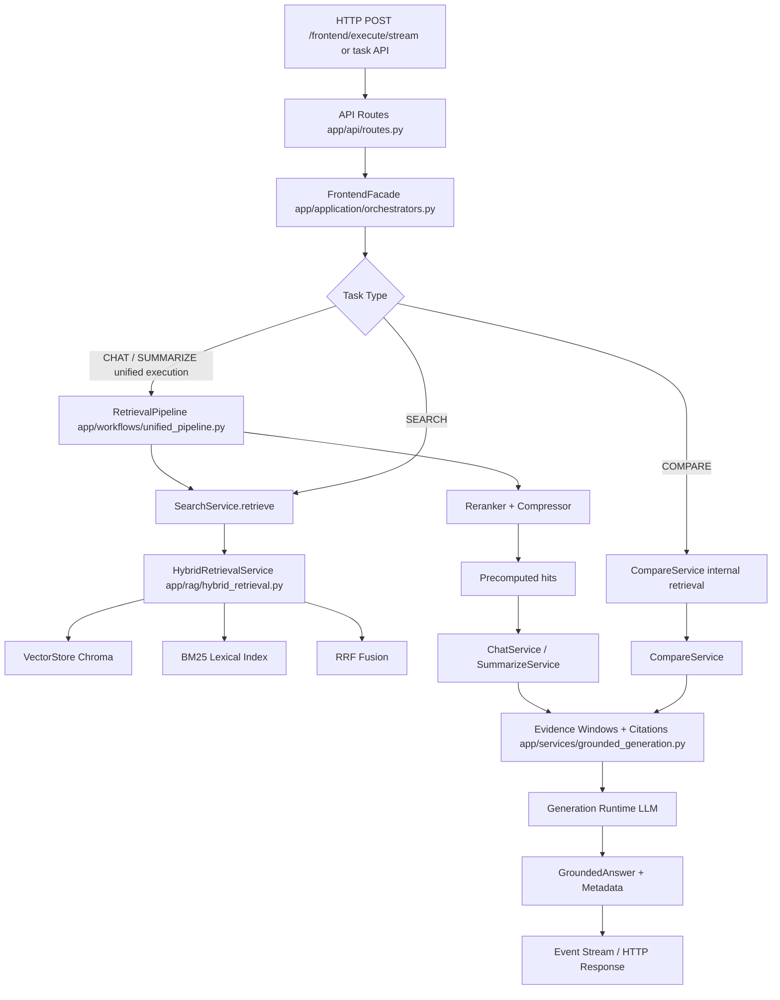
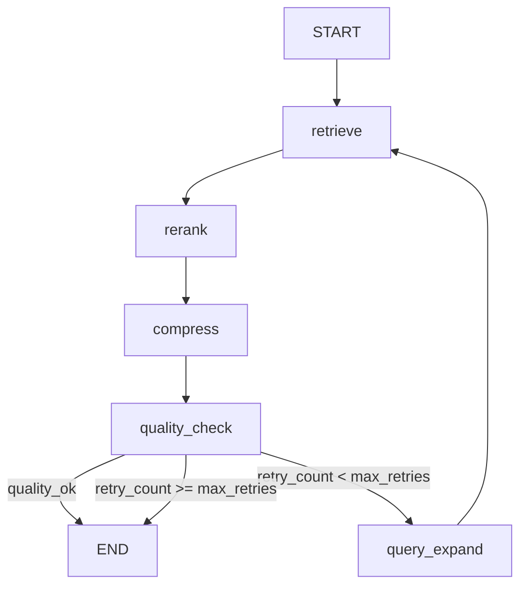
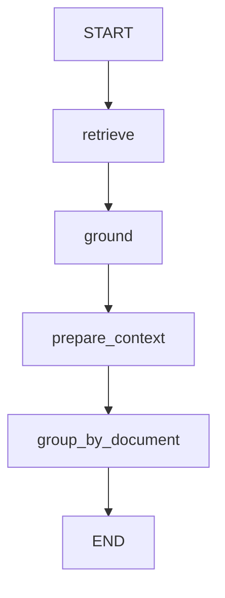

# MindDock Workflow Architecture

> Document version: 2026-04-30  
> Scope: production RAG query path and LangGraph workflow modules  
> Audience: thesis defense reviewers  

---

## 1. Overview

MindDock implements a **layered, service-led RAG architecture** that separates frontend-facing orchestration, application services, retrieval infrastructure, skill-based source loading, and workflow orchestration modules. This document explains how the current production path combines service-owned business logic with reusable LangGraph retrieval preparation.

1. **The service-level RAG path** — stable, tightly integrated, and responsible for generation, citation assembly, evidence windows, source scope guardrails, compare/search behavior, and final response shaping.
2. **The LangGraph retrieval workflow modules** — pluggable workflow modules used for unified chat/summarize retrieval preparation and as a future consolidation path. They are not a fully autonomous production agent.
3. **The source skill layer** — builtin and local skill binding metadata for source loading, backed by trusted loaders and handlers.

---

## 2. Production Query Path

The following diagram shows the end-to-end path from an HTTP request to a grounded answer.

### 2.1 Entry Layer: FrontendFacade

`FrontendFacade` (`app/application/orchestrators.py`) is the single boundary between HTTP routes and the application layer. It delegates to task-specific orchestrators:

- **ChatOrchestrator** — handles `CHAT` tasks, including intent classification, scope guardrails, and retrieval pool sizing.
- **SummarizeOrchestrator** — handles `SUMMARIZE` tasks with larger retrieval pools.
- **CompareOrchestrator** — handles `COMPARE` tasks with paired-evidence retrieval.
- **KnowledgeBaseOrchestrator** — handles source catalog operations (ingest, list, delete, reingest).

The orchestrators also manage **execution runs**, **client event streaming**, and **skill invocation** when skills are requested. For unified `CHAT` and `SUMMARIZE` execution, `FrontendFacade` can run `RetrievalPipeline` first and pass precomputed hits into the service layer. For `SEARCH`, retrieval remains service-direct. For `COMPARE`, `CompareService` keeps its own paired-evidence retrieval path.

### 2.2 Service Layer: ChatService

`ChatService` (`app/services/chat_service.py`) owns the **production answer-generation pipeline**. Depending on entry path, it may receive precomputed hits from `RetrievalPipeline` or retrieve internally through `SearchService`. It still owns the final grounding and answer behavior:

| Stage | What happens | Key module |
|-------|-------------|------------|
| 1. Scope guardrail | Detect out-of-scope queries and single-document scope mismatches | `grounded_generation.py` |
| 2. Retrieval preparation | Use precomputed hits from `RetrievalPipeline` or fetch candidate chunks via `SearchService` | `orchestrators.py`, `unified_pipeline.py`, `search_service.py` |
| 3. Structured ref injection | If the query mentions tables/figures, inject lexical candidates | `chat_service.py` |
| 4. Grounding filter | Discard chunks with distance >= 1.5 | `grounded_generation.py` |
| 5. Relevance gate | Lexical sanity check between query and evidence | `grounded_generation.py` |
| 6. Rerank | Heuristic reranking + directness scoring + local-doc priority | `chat_service.py`, `postprocess.py` |
| 7. Source consistency cap | Keep top-k diverse across sources unless cross-source intent detected | `chat_service.py` |
| 8. Evidence windows | Expand each hit with neighboring chunks for citation context | `grounded_generation.py` |
| 9. Compression | Sentence-level trimming to fit context window | `postprocess.py` |
| 10. Generation | Call LLM runtime with grounded prompt | `GenerationRuntime` |
| 11. Citation assembly | Build `CitationRecord` and `EvidenceObject` lists | `grounded_generation.py` |

The service result produces:
- `answer` — the generated text
- `citations` — traceable citation records with chunk IDs, snippets, and page numbers
- `evidence` — machine-consumable evidence objects with freshness scores
- `workflow_trace` — a detailed trace of every rule applied during the pipeline

### 2.3 Retrieval Infrastructure

**SearchService** (`app/services/search_service.py`) is the bridge between application services and the vector store. It supports:

- **Single-source retrieval** — standard Chroma similarity search or hybrid retrieval.
- **Multi-source scoped retrieval** — when the frontend selects multiple sources, it fans out to query each source independently (because Chroma `where` clauses only support single-source equality), then merges and deduplicates results.
- **Structured reference lexical retrieval** — for explicit table/figure queries, it runs a separate lexical candidate search.

**HybridRetrievalService** (`app/rag/hybrid_retrieval.py`) combines:
- Dense retrieval via Chroma embeddings
- BM25 lexical scoring with jieba tokenization for Chinese text
- Reciprocal Rank Fusion (RRF) to merge the two ranked lists

**Postprocess layer** (`app/rag/postprocess.py`) provides:
- **Reranker** — heuristic rescoring based on query-token overlap and section-title matching
- **Compressor** — sentence-level trimming that keeps the most query-relevant sentences per chunk

### 2.4 Citations and Evidence Windows

`grounded_generation.py` builds the final citation and evidence models:

- **CitationRecord** — human-readable citation with snippet, page, anchor, and window metadata
- **EvidenceObject** — machine-consumable evidence with freshness (`fresh` / `stale_possible` / `invalidated`)
- **EvidenceWindow** — expands a single hit into a window of neighboring chunks from the same document, bounded by `MAX_EVIDENCE_WINDOW_BLOCKS` (5) and `MAX_EVIDENCE_WINDOW_CHARS` (2400)

This windowing ensures that citations in the final answer refer to meaningful passages rather than isolated sentences.

---

## 3. LangGraph Workflow Modules

MindDock includes two LangGraph-based workflow modules that demonstrate graph-based retrieval orchestration. **LangGraph is used as a retrieval workflow module rather than a fully autonomous production agent framework.** It prepares retrieval state; the service layer remains responsible for source scope guardrails, generation, citations, evidence windows, compare/search behavior, and final response shaping.

### 3.1 unified_pipeline.py

`app/workflows/unified_pipeline.py` defines `RetrievalPipeline`, a **retrieve → rerank → compress** graph with **quality checking and conditional retry**.

**Graph nodes:**

| Node | Purpose |
|------|---------|
| `retrieve` | Fetch hits from `SearchService` |
| `rerank` | Apply heuristic reranking |
| `compress` | Apply sentence-level compression |
| `quality_check` | Rule-based quality gate (empty hits, weak distances, insufficient diversity) |
| `query_expand` | Strip instruction words and increase `top_k` for one retry |

**Quality rules:**
- No hits retrieved → fail
- All distances >= 1.5 → low confidence flag
- Summarize task with < 2 compressed hits → fail
- Max 1 retry attempt

The graph exposes both `invoke()` (batch) and `stream()` (step-by-step with event emission) interfaces. In unified chat/summarize execution, the orchestrator can run this pipeline before calling the service layer. When LangGraph is unavailable, a `_SequentialGraph` fallback provides the same behavior without the graph dependency.

### 3.2 langgraph_pipeline.py

`app/workflows/langgraph_pipeline.py` defines a simpler linear graph:

**Graph nodes:**

| Node | Purpose |
|------|---------|
| `retrieve` | Fetch hits from `SearchService` |
| `ground` | Filter hits by distance threshold (`select_grounded_hits`) |
| `prepare_context` | Build `ContextBlock` and `CitationRecord` list |
| `group_by_document` | Group grounded hits by `doc_id` for document-level evidence views |

This module is intended for **retrieval preparation** workflows where the caller only needs evidence assembly, not full generation.

### 3.3 Honest Assessment

| Aspect | Service-level pipeline | LangGraph modules |
|--------|----------------------|-------------------|
| **Production traffic** | ✅ Yes — service layer owns final task behavior | ⚠️ Partial — `RetrievalPipeline` is used for unified chat/summarize retrieval preparation |
| **Citations / windows** | ✅ Full support | ⚠️ Partial — `langgraph_pipeline.py` prepares citations but does not manage windows |
| **Workflow trace** | ✅ Detailed trace with rule annotations | ⚠️ Basic — `unified_pipeline.py` emits stage events |
| **Conditional retry** | ⚠️ Service-specific deterministic fallbacks | ✅ `unified_pipeline.py` has `quality_check → query_expand` loop |
| **Skill integration** | ✅ Full at orchestrator/source-loading boundaries | ❌ None inside the retrieval graph |
| **Scope guardrails** | ✅ Full in service/orchestrator logic | ⚠️ Receives filters but does not own chat-specific guardrail policy |

**Current state:** MindDock uses a hybrid architecture. `RetrievalPipeline` can participate in unified chat/summarize retrieval preparation, while the service layer remains the production owner of generation, citations, evidence windows, source-scoped trust behavior, compare/search behavior, and response metadata. LangGraph is therefore a workflow module and future consolidation path, not a full replacement for `ChatService`.

---

## 4. Source Skill Layer

MindDock also exposes a lightweight source skill system for demo clarity and future extensibility.

| Source type | Current builtin skill behavior |
|-------------|--------------------------------|
| Images | `image.ocr` uses RapidOCR by default. Long screenshots can be sliced vertically, and OCR boxes are sorted into reading order. |
| Video/audio | `video.transcribe` / `audio.transcribe` support sidecar transcripts as the stable demo path. If no sidecar exists, media falls back to configured transcript providers such as mock, disabled, OpenAI-style API, or Local ASR. |
| CSV | `csv.extract` parses CSV rows into readable text chunks. |
| URL | `url.extract` fetches static HTML and records extraction quality metadata. |
| PDF/text/markdown | File extraction skills resolve consistently for CLI/demo binding metadata. |

`skill-resolve` preserves local manifest precedence. If no local manifest matches, implemented builtin source skills provide deterministic fallback bindings for common source types. Actual loading still goes through trusted loaders and handlers; MindDock does not execute arbitrary user-provided code as part of source ingestion.

The video demo should be worded as transcript-based media ingestion. Sidecar transcript is the most stable local representation that enters the normal RAG path. Remote API transcription and Local ASR are configurable transcript providers, but MindDock still does not perform native video-frame understanding or multimodal video reasoning.

---

## 5. Why This Design Is Acceptable

1. **Stability vs. experimentation separation**  
   The service-level pipeline (`ChatService`, `SummarizeService`, `CompareService`) owns final task behavior, while LangGraph modules focus on retrieval preparation and event visibility. This keeps the production answer path stable while still demonstrating graph orchestration.

2. **Fallback safety**  
   Both `unified_pipeline.py` and `langgraph_pipeline.py` include `_SequentialGraph` fallbacks that execute the same node logic sequentially when `langgraph` is not installed. This ensures the codebase never has a hard dependency on the graph framework.

3. **Observable graph semantics**  
   The `unified_pipeline.py` graph emits `RetrievalPipelineProgressPayload` events after each stage (`retrieve`, `rerank`, `compress`). This makes the graph behavior observable from the orchestrator layer without adding complexity to the production path.

4. **Future consolidation path**  
   Future work can move more retrieval preparation and quality control into `RetrievalPipeline`, while preserving all existing post-processing responsibilities such as citations, evidence windows, trace, and response shaping.

---

## 6. Future Work

The following improvements are identified for future iterations:

1. **Fuller workflow consolidation**  
   Move more retrieval preparation and quality-control behavior into `RetrievalPipeline`, while preserving service-owned citation assembly, evidence window expansion, scope guardrails, and response shaping.

2. **MemorySaver / checkpoint for multi-turn retrieval state**  
   Use LangGraph's `MemorySaver` to persist retrieval state across multiple turns in a conversation, enabling incremental refinement without re-fetching the full candidate set.

3. **Human-in-the-loop interrupt before retry**  
   Add a conditional breakpoint before the `query_expand` node that allows a human reviewer to approve or rewrite the expanded query, especially useful for high-stakes domain queries.

4. **Parallel hybrid retrieval branch**  
   Split the `retrieve` node into parallel dense and lexical branches that converge before reranking, replacing the current sequential hybrid service call.

5. **LLM-as-judge quality evaluation**  
   Replace the rule-based `quality_check` node with an LLM-based judge that assesses whether the compressed evidence actually answers the query, improving retry decisions.

6. **Video `multimodal_frames` provider**  
   Add an optional provider that samples video frames, calls a vision model, and converts visual observations into a transcript-like text representation. This should complement, not replace, sidecar transcripts; sidecar should remain the most stable demo path.

7. **Production calendar sync for schedule candidates**
   Connect the schedule-candidate review workflow to a real calendar provider only after conflict handling, user confirmation, duplicate detection, and permission boundaries are designed.

---

## 7. Module Map

| Module | Role |
|--------|------|
| `app/api/routes.py` | HTTP entry points |
| `app/application/orchestrators.py` | `FrontendFacade`, `ChatOrchestrator`, task dispatch |
| `app/services/chat_service.py` | **Production RAG pipeline** |
| `app/skills/source_binding.py` | Local/builtin source skill resolution |
| `app/rag/image_loader.py` | RapidOCR-backed image OCR loader |
| `app/rag/media_loader.py` | Audio/video transcript loader with sidecar, API, mock, disabled, and Local ASR provider support |
| `app/runtime/media_transcript_active_config.py` | Active media transcript provider configuration |
| `app/runtime/local_asr_bootstrap.py` | Local ASR companion-server bootstrap and model-status helpers |
| `app/schedule/` | Schedule-candidate extraction, models, and local store |
| `app/services/search_service.py` | Retrieval bridge (Chroma + hybrid) |
| `app/services/grounded_generation.py` | Citations, evidence, windows, grounding assessment |
| `app/rag/hybrid_retrieval.py` | Dense + BM25 + RRF fusion |
| `app/rag/postprocess.py` | Reranker and Compressor |
| `app/rag/vectorstore.py` | Chroma wrapper (`LangChainChromaStore`) |
| `app/workflows/unified_pipeline.py` | LangGraph retrieve → rerank → compress + quality retry |
| `app/workflows/langgraph_pipeline.py` | LangGraph retrieve → ground → context → group |
| `app/llm/factory.py` | `GenerationRuntime` and provider selection |
